<!-- hero: monochrome ASCII portrait (types in) beside a neofetch-style info
     panel. regenerate portrait: python scripts/prep_photo.py <photo> &&
     python scripts/make_ascii_svg.py ; info panel: python scripts/make_info_card.py -->

<!-- animated contribution graph: real data, boxes reveal cell by cell
     (regenerated daily by .github/workflows/update-profile-art.yml) -->

<h3><code>vinciarya@github ~ $ ./contributions.sh</code></h3>

 
 

<!-- self-updating newspaper front page: real daily dev news (GitHub Releases,
     HN, GitHub Search, endoflife.date, Statuspage), regenerated daily by
     .github/workflows/daily-feed.yml. Pipeline: scripts/fetch.py -> data/feed.json
     -> scripts/newspaper.py -> scripts/readme_index.py. Everything between the
     daily-commit markers below is generated -- edit readme_index.py, not this. -->

<h3><code>vinciarya@github ~ $ ./the-daily-commit.sh</code></h3>

<!-- daily-commit:start -->

 [GPT-6 Astra](https://openai.com/index/gpt-6-astra/) `1638 pts` · [Ask HN: Why were OpenAI, Claude, and…](https://news.ycombinator.com/item?id=49551096) `360 pts` · [K2 Horizon: A connected fleet of six…](https://ifm.ai/blog/k2/) `287 pts` 
 [affaan-m/ECC](https://github.com/affaan-m/ECC) `+941★` · [NousResearch/hermes-agent](https://github.com/NousResearch/hermes-agent) `+726★` · [obra/superpowers](https://github.com/obra/superpowers) `+538★` · [torvalds/linux](https://github.com/torvalds/linux) `+521★` 
 [.name Termination](https://neil.fraser.name/news/2026/09/03/) `1648 pts` · [Audacity 4.0](https://github.com/audacity/audacity/releases/tag/Audacity-4.0.0) `1092 pts` · [Any Human Ever – One life, drawn at…](https://anyhumanever.com/) `548 pts` · [Qwen 3.8 27B available on Cerebras at…](https://inference-docs.cerebras.ai/models/overview) `520 pts` 
 [anthropics/commerce-agents](https://github.com/anthropics/commerce-agents) `1.7k★` · [rakanki911/DLSS5-Swapper](https://github.com/rakanki911/DLSS5-Swapper) `1.2k★` · [GangTailorUpgrade/undress-service](https://github.com/GangTailorUpgrade/undress-service) `1.0k★` · [shadcn-ui/cn](https://github.com/shadcn-ui/cn) `998★` 
 [Anthropic 177min](https://stspg.io/9xz4hhmd1jzn) `major`

<!-- daily-commit:end -->

 
 

<h3><code>vinciarya@github ~ $ whoami</code></h3>

<table>
<tr>
<td valign="top"></td>
<td valign="top"></td>
</tr>
</table>

 
 

<h3><code>vinciarya@github ~ $ ./links.sh</code></h3>

<b>Software Engineer ·  AI Builder</b>

 

