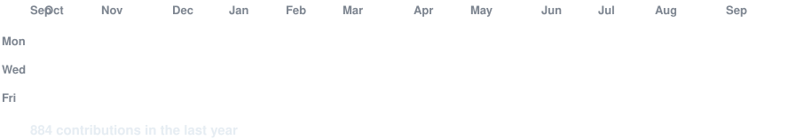

<!-- hero: monochrome ASCII portrait (types in) beside a neofetch-style info
     panel. regenerate portrait: python scripts/prep_photo.py <photo> &&
     python scripts/make_ascii_svg.py ; info panel: python scripts/make_info_card.py -->

<!-- animated contribution graph: real data, boxes reveal cell by cell
     (regenerated daily by .github/workflows/update-profile-art.yml) -->

<h3><code>vinciarya@github ~ $ ./contributions.sh</code></h3>

 
 

<!-- self-updating newspaper front page: real daily dev news (GitHub Releases,
     HN, GitHub Search, endoflife.date, Statuspage), regenerated daily by
     .github/workflows/daily-feed.yml. Pipeline: scripts/fetch.py -> data/feed.json
     -> scripts/newspaper.py -> scripts/readme_index.py. Everything between the
     daily-commit markers below is generated -- edit readme_index.py, not this. -->

<h3><code>vinciarya@github ~ $ ./the-daily-commit.sh</code></h3>

<!-- daily-commit:start -->

 [From the creator of Redis; run LLM…](https://dwarfstar.sh/) `217 pts` · [With most information hidden, the…](https://arstechnica.com/science/2026/10/ai-finally-beat-the-best-stratego-player-in-history-and-did-it-on-a-budget/) `209 pts` · [AI Makes Me Sad](https://mondobe.com/ai-makes-me-sad) `183 pts` 
 [mattpocock/skills](https://github.com/mattpocock/skills) `+713★` · [deepseek-ai/deepseek-harness](https://github.com/deepseek-ai/deepseek-harness) `+591★` · [obra/superpowers](https://github.com/obra/superpowers) `+470★` · [paperclipai/paperclip](https://github.com/paperclipai/paperclip) `+456★` 
 [Apple Pass Designer](https://developer.apple.com/pass-designer/) `399 pts` · [The Legend of von Neumann (1973) \[pdf\]](https://gwern.net/doc/math/1973-halmos.pdf) `273 pts` · [A 12-year sequence of telescope…](https://bsky.app/profile/theplanetaryguy.com/post/3mwucf5ert22f) `257 pts` · [Zig v0.17.0](https://ziglang.org/download/0.17.0/release-notes.html) `240 pts` 
 [KKKKhazix/AIHOT](https://github.com/KKKKhazix/AIHOT) `5.0k★` · [Louis-CFM/coucou](https://github.com/Louis-CFM/coucou) `3.1k★` · [feder-cr/dots](https://github.com/feder-cr/dots) `2.6k★` · [rehan-remade/universal-modder](https://github.com/rehan-remade/universal-modder) `2.3k★` 
 [Cloudflare 11min](https://www.cloudflarestatus.com/incidents/2xnmsnv8yv5x) `critical`

<!-- daily-commit:end -->

 
 

<h3><code>vinciarya@github ~ $ whoami</code></h3>

<table>
<tr>
<td valign="top"></td>
<td valign="top"></td>
</tr>
</table>

 
 

<h3><code>vinciarya@github ~ $ ./links.sh</code></h3>

<b>Software Engineer ·  AI Builder</b>

 

